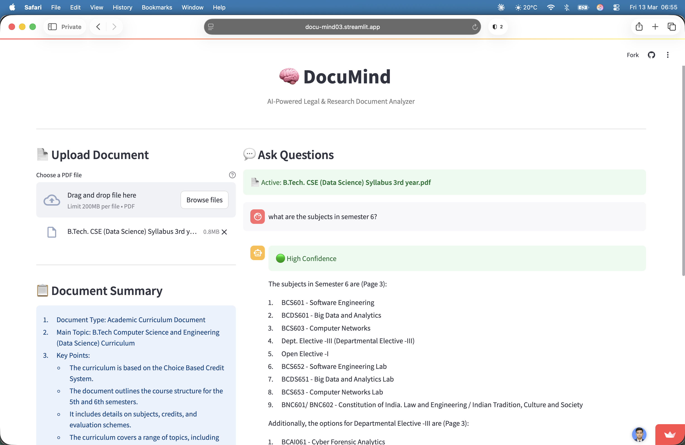

# 🧠 DocuMind — AI-Powered Document Analyzer


> Upload any legal contract or research paper — ask questions in plain English — get accurate answers with **exact page citations**. No hallucination guaranteed.

## 🚀 Live Demo

**[👉 Try DocuMind Live — docu-mind03.streamlit.app](https://docu-mind03.streamlit.app/)**



> ⚡ No installation needed — upload any PDF and start asking questions instantly!
---

## 🎯 What Problem Does This Solve?

Reading a 100-page legal contract or research paper to find one specific clause is **time-consuming and error-prone**.

DocuMind lets you:
- Upload any PDF document
- Ask questions in plain English
- Get precise answers with **page number citations**
- Know **exactly** which part of the document was used
- Never get hallucinated answers — strict document-only responses

---

## ✨ Features

| Feature | Description |
|---------|-------------|
| 📄 PDF Upload | Upload any legal or research PDF |
| 🧩 Smart Chunking | 1000-token chunks with 200-token overlap |
| 🔍 Semantic Search | HuggingFace embeddings + ChromaDB vector search |
| 🤖 LLM Answer | Groq LLaMA3-70b generates accurate answers |
| 📌 Source Citations | Every answer shows exact page numbers |
| 📋 Auto Summary | Document summary generated on upload |
| 🟢🔴 Confidence Score | Green = found in doc, Red = not found |
| 🚫 No Hallucination | Strict prompting — only answers from document |

---

## 🏗️ Architecture
```
User uploads PDF
      ↓
PDF → Pages → Chunks (1000 tokens, 200 overlap)
      ↓
HuggingFace Embeddings (all-MiniLM-L6-v2)
      ↓
ChromaDB Vector Store
      ↓
User asks question → Similarity Search → Top 3 chunks
      ↓
Groq LLaMA3-70b → Answer with page citations
      ↓
Streamlit UI displays answer + confidence + sources
```

---

## 🛠️ Tech Stack

| Layer | Technology |
|-------|-----------|
| **Frontend** | Streamlit |
| **Backend** | FastAPI + Uvicorn |
| **RAG Pipeline** | LangChain |
| **Embeddings** | HuggingFace `all-MiniLM-L6-v2` |
| **Vector DB** | ChromaDB (Persistent) |
| **LLM** | Groq API — LLaMA3-70b-versatile |
| **PDF Processing** | PyPDF |

---

## 📁 Project Structure
```
DocuMind/
├── backend/
│   ├── main.py          # FastAPI server — 3 endpoints
│   ├── rag_pipeline.py  # Embeddings + ChromaDB + Groq LLM
│   ├── summarizer.py    # Auto document summary
│   └── utils.py         # PDF loader + chunker
├── frontend/
│   └── app.py           # Streamlit UI
├── uploads/             # Uploaded PDFs stored here
├── chroma_db/           # Vector embeddings stored here
├── .env.example         # Environment variables template
├── .gitignore
└── requirements.txt
```

---

## ⚙️ How to Run Locally

### 1. Clone the repository
```bash
git clone https://github.com/bhatt-aditya03/DocuMind.git
cd DocuMind
```

### 2. Create virtual environment
```bash
python3 -m venv venv
source venv/bin/activate  # Mac/Linux
venv\Scripts\activate     # Windows
```

### 3. Install dependencies
```bash
pip install -r requirements.txt
```

### 4. Set up environment variables
```bash
cp .env.example .env
# Add your Groq API key in .env
```

### 5. Run the app
```bash
streamlit run frontend/app.py
```

### 6. Open in browser
```
http://localhost:8501
```

---

## 🔑 Environment Variables

Create a `.env` file in root directory:
```env
GROQ_API_KEY=your_groq_api_key_here
```

Get your free Groq API key at [console.groq.com](https://console.groq.com)

---

## 📡 API Endpoints (Local Development)

| Method | Endpoint | Description |
|--------|----------|-------------|
| `GET` | `/` | API health check |
| `POST` | `/upload` | Upload and process PDF |
| `POST` | `/ask` | Ask question about document |
| `GET` | `/summary/{doc_id}` | Get document summary |

### Example Request
```bash
# Upload PDF
curl -X POST "http://localhost:8000/upload" \
  -F "file=@document.pdf"

# Ask question
curl -X POST "http://localhost:8000/ask" \
  -H "Content-Type: application/json" \
  -d '{"question": "What are the key clauses?", "doc_id": "document"}'
```

---

## 💡 Use Cases

- 📜 **Legal Contracts** — Find specific clauses instantly
- 📚 **Research Papers** — Extract key findings and methodology
- 📋 **Policy Documents** — Understand complex policies quickly
- 🎓 **Academic Syllabi** — Navigate course content easily
- 📑 **Business Reports** — Quick insights from long reports

---

## 🗓️ Built In 5 Days

| Day | What was built |
|-----|---------------|
| Day 1 | Project setup, dependencies, environment |
| Day 2 | RAG pipeline — PDF chunking, ChromaDB, Groq LLM |
| Day 3 | FastAPI backend — upload, ask, summary endpoints |
| Day 4 | Streamlit UI — chat interface, confidence indicator |
| Day 5 | README, deployment, live on Streamlit Cloud |

> **Post-launch refactor:** `@lru_cache` for embedding model, specific exception handling, shared `sanitize_doc_id()` utility, temp file cleanup, and English docstrings throughout.

---

## 🧑‍💻 Author

**Aditya Bhatt**

---

## 📄 License

MIT License — free to use, modify and distribute!